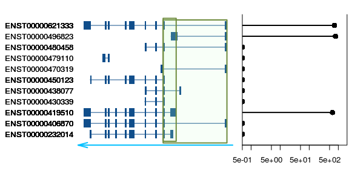
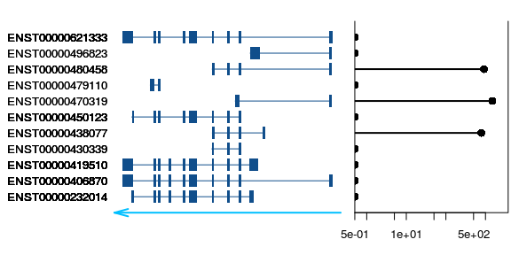

Circtools
================
Alexey Uvarovskii
2017-04-20

Introduction
------------

The package aims to simplify analysis of the RNA-seq experiments for circular RNA detection and quantification. Once a candidate list of possible circulirised RNA is provided (e.g. after analysis with splice-aware alignment tools like STAR and circRNA detection software like DCC or CIRI), it may be necessary to validate such transcripts by PCR.

We implemented a set of functions which could assist to design such validation experiments. A biologist might be interested to know

-   which linear trabscripts are expressed and at which level
-   which transcripts have common exons with the predicted circRNA
-   how to design primers for the chosen linear and circular transcripts.

A proposed workflow
-------------------

1.  Prepare the input data set:
    -   the gene model: a GTF/GFF file, TxDb or EnsDb objects
    -   transcripts counts
    -   splice junction coordinates for the circular candidates.

2.  Generate sequences of the exons around the splice junctions.
3.  Plot the gene model to see relation of linear and circular transcripts.
4.  Design optimal primers for the circular and linear transcripts of interest.
5.  Plot the gene model and the primers to validate the design.

Transcript plot
---------------

One would like to know, how the predicted circRNA relate to the linear transcripts. In order to see, which transcripts are expressed and what is their gene model (i.e. exon content), we implemented a plotting function. It shows a block structure for every annotated transcript, a coordinate range which is covered by the circRNA candidate and plots read counts for the transcripts if they are provided.

Annotation source
-----------------

Coordinates and types of genomic features must be known in advance, and it can be provided in the form of `GTF/GFF` file or `TxDb`/`EnsDb` objects. In the frame of the package we encourage one to use the Ensemble annotation files or R packages, which can be downloaded from the [Ensembl site](http://www.ensembl.org) or installed via the Bioconductor ecosystem:

``` r
source("https://bioconductor.org/biocLite.R")
biocLite("EnsDb.Hsapiens.v86")
```

In this example we are using the `ensembldb` package for annotation:

``` r
suppressPackageStartupMessages(
  library("EnsDb.Hsapiens.v86")
)
db <- EnsDb.Hsapiens.v86
```

In the first step, the helper function create an object, which keep relations between the annotated transcripts and coordinates for the predicted circRNAs. We assume that a user have a `data.frame` or `GRanges` object with splice junctions coordinates from which circRNAs are derived. The input must contain the chromosome, start, end and the strand of the splice junction.

Generate mock data
------------------

Here we create a splice junction GRanges:

``` r
geneName <- "BCL6"
circs <- createCirc(geneName, db)
circs
```

    ## GRanges object with 2 ranges and 1 metadata column:
    ##       seqnames                 ranges strand |                CIRCID
    ##          <Rle>              <IRanges>  <Rle> |           <character>
    ##   [1]        3 [187734869, 187745727]      - | 3:187734869-187745727
    ##   [2]        3 [187734869, 187737088]      - | 3:187734869-187737088
    ##   -------
    ##   seqinfo: 1 sequence from GRCh38 genome

Let us simulate some numbers for read counts for transcripts of the BCL6 gene:

``` r
counts <- makeCounts(geneName, db)
tail(counts)
```

    ##                 id count
    ## 6  ENST00000450123     0
    ## 7  ENST00000470319     0
    ## 8  ENST00000479110     0
    ## 9  ENST00000480458     0
    ## 10 ENST00000496823   800
    ## 11 ENST00000621333   738

The workflow entry point
------------------------

Using the splice junction table and annotation object, prepare the `CircData` object:

``` r
suppressPackageStartupMessages(
  library(circtools)
)
circData <- CircData(db, circs)
```

Plot the gene model, circular transcripts and read counts for the BCL6 gene:

``` r
bcl6EnsId <- circData$sjGeneIds
bcl6EnsId
```

    ## [1] "ENSG00000113916"

``` r
plotCirc(circGenes = bcl6EnsId,
         circData = circData,
         counts = counts)
```



Alternatively, the `plotTranscripts` function can be used for plotting from `data.frame` or `GRanges` objects provided by the user. Since this function does not use any annotation information, it plots all provided objects:

``` r
ex <- ensembldb::exonsBy(db,  by = "tx",
                         filter = list(GenenameFilter(geneName)))
plotTranscripts(ex, counts = counts)
```



Report sequences of the splice junction exons
---------------------------------------------

Most probably, an experimentalist is interested to obtain the sequencies of the splice junction exons. The sequencies will be used for the following primer design to validate the discovered transcripts using the PCR.

To achieve it, besides the gene model annotation, one needs a fasta file or an R package with the corresponding genome sequence. a BSgenome Bioconductor package can be used:

``` r
suppressPackageStartupMessages(
  library(BSgenome.Hsapiens.NCBI.GRCh38))
bsg <- BSgenome.Hsapiens.NCBI.GRCh38
```

Several exons with the same start but different lengths can be included in the annotation. By default, all described exons, which start or end at the position of the circular splice junction will be reported. It is possible to include the shortes or the longest sequence by setting the `type` argument:

``` r
# for all exons use
# exSeq <- getExonSeqs(circData = circData, bsg = bsg, type = "all")
exShortesSeq <- getExonSeqs(circData = circData, bsg = bsg, type = "shortest")
exShortesSeq[['3:187734869-187737088']]
```

    ## GRanges object with 2 ranges and 5 metadata columns:
    ##       seqnames                 ranges strand |         exon_id
    ##          <Rle>              <IRanges>  <Rle> |     <character>
    ##   [1]        3 [187736090, 187737088]      - | ENSE00001666929
    ##   [2]        3 [187734869, 187734882]      - | ENSE00002535122
    ##               gene_id                CIRCID        side
    ##           <character>           <character> <character>
    ##   [1] ENSG00000113916 3:187734869-187737088        left
    ##   [2] ENSG00000113916 3:187734869-187737088       right
    ##                           seq
    ##                <DNAStringSet>
    ##   [1] TCTCATTGAC...TGCTCATTTG
    ##   [2]          AAGCAAGGCATTGG
    ##   -------
    ##   seqinfo: 1 sequence from GRCh38 genome

Experimentalists might be interested in obtaining a list with exon sequences and their coordinates for every circular splice junction.

Having the list of sequences from the `getExonSeqs` function and the `CircData` object, let us create an HTML report to present it to the biologists:

``` r
reportCircs(exSeq = exShortesSeq, file = "report.html")
```

The resulting html file includes the information on the exon coordinates and sequences for the following primer design.


Design and validate primers
---------------------------

TODO

Session
-------

``` r
sessionInfo()
```

    ## R version 3.3.3 (2017-03-06)
    ## Platform: x86_64-pc-linux-gnu (64-bit)
    ## Running under: Ubuntu 16.04.2 LTS
    ## 
    ## locale:
    ##  [1] LC_CTYPE=en_US.UTF-8       LC_NUMERIC=C              
    ##  [3] LC_TIME=de_DE.UTF-8        LC_COLLATE=en_US.UTF-8    
    ##  [5] LC_MONETARY=de_DE.UTF-8    LC_MESSAGES=en_US.UTF-8   
    ##  [7] LC_PAPER=de_DE.UTF-8       LC_NAME=C                 
    ##  [9] LC_ADDRESS=C               LC_TELEPHONE=C            
    ## [11] LC_MEASUREMENT=de_DE.UTF-8 LC_IDENTIFICATION=C       
    ## 
    ## attached base packages:
    ## [1] stats4    parallel  methods   stats     graphics  grDevices utils    
    ## [8] datasets  base     
    ## 
    ## other attached packages:
    ##  [1] BSgenome.Hsapiens.NCBI.GRCh38_1.3.1000
    ##  [2] BSgenome_1.42.0                       
    ##  [3] rtracklayer_1.34.2                    
    ##  [4] Biostrings_2.42.1                     
    ##  [5] XVector_0.14.1                        
    ##  [6] circtools_0.0.0.9000                  
    ##  [7] EnsDb.Hsapiens.v86_2.1.0              
    ##  [8] ensembldb_1.6.2                       
    ##  [9] GenomicFeatures_1.26.4                
    ## [10] AnnotationDbi_1.36.2                  
    ## [11] Biobase_2.34.0                        
    ## [12] GenomicRanges_1.26.4                  
    ## [13] GenomeInfoDb_1.10.3                   
    ## [14] IRanges_2.8.2                         
    ## [15] S4Vectors_0.12.2                      
    ## [16] BiocGenerics_0.20.0                   
    ## [17] rmarkdown_1.4                         
    ## 
    ## loaded via a namespace (and not attached):
    ##  [1] Rcpp_0.12.10                  BiocInstaller_1.24.0         
    ##  [3] AnnotationHub_2.6.5           bitops_1.0-6                 
    ##  [5] tools_3.3.3                   zlibbioc_1.20.0              
    ##  [7] biomaRt_2.30.0                digest_0.6.12                
    ##  [9] RSQLite_1.1-2                 evaluate_0.10                
    ## [11] memoise_1.0.0                 lattice_0.20-35              
    ## [13] Matrix_1.2-8                  shiny_1.0.2                  
    ## [15] DBI_0.6-1                     yaml_2.1.14                  
    ## [17] stringr_1.2.0                 httr_1.2.1                   
    ## [19] knitr_1.15.1                  rprojroot_1.2                
    ## [21] grid_3.3.3                    R6_2.2.0                     
    ## [23] XML_3.98-1.6                  BiocParallel_1.8.1           
    ## [25] magrittr_1.5                  backports_1.0.5              
    ## [27] Rsamtools_1.26.1              htmltools_0.3.5              
    ## [29] GenomicAlignments_1.10.1      SummarizedExperiment_1.4.0   
    ## [31] xtable_1.8-2                  mime_0.5                     
    ## [33] interactiveDisplayBase_1.12.0 httpuv_1.3.3                 
    ## [35] stringi_1.1.5                 RCurl_1.95-4.8
