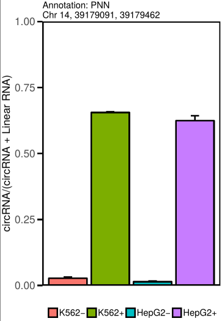

CircTest module
********************************************************

The CircTest module of circtools allows to test the variation of circRNAs in respect to host genes. It is recommended to work with the output of the ``circtools detect`` module, but can also run on custom count tables. Required are one table with circular RNA counts and one table containing with host-gene counts. These tables have to have the same order, i.e. ``circ[i,j]`` and ``linear[i,j]`` are read-counts for the same circRNA in the same sample.

The ``circtools circtest`` module is based on the equally named R package `CircTest <https://github.com/dieterich-lab/CircTest>`_

Required tools and packages
----------------------------

``circtools circtest`` depends on R and the following R packages:

* aod
* ggplot2
* plyr

The ``CircTest`` R package as well as all dependencies are installed during the circtools installation procedure.

Manual installation instructions
--------------------------------

The following commands have to be performed within an R shell::

    > install.packages("devtools")
    > require(devtools)
    > install_github('dieterich-lab/CircTest')
    > library(CircTest)

Usage with ``circtools detect`` data
-------------------------------------

A call to ``circtools circtest --help`` shows all available command line flags:

.. code-block:: bash

    usage: circtools [-h] -d DCC_DIR -l CONDITION_LIST -c CONDITION_COLUMNS -g
                     GROUPING [-r NUM_REPLICATES] [-f MAX_FDR] [-p PERCENTAGE]
                     [-s FILTER_SAMPLE] [-C FILTER_COUNT] [-o OUTPUT_DIRECTORY]
                     [-n OUTPUT_NAME] [-m MAX_PLOTS] [-a LABEL] [-L RANGE]
                     [-O ONLY_NEGATIVE] [-H ADD_HEADER] [-M {colour,bw}]
    
    circular RNA statistical testing - Interface to https://github.com/dieterich-lab/CircTest
    
    optional arguments:
      -h, --help            show this help message and exit
    
    Required:
      -d DCC_DIR, --DCC DCC_DIR
                            Path to the detect/DCC data directory
      -l CONDITION_LIST, --condition-list CONDITION_LIST
                            Comma-separated list of conditions which should be
                            comparedE.g. "RNaseR +","RNaseR -"
      -c CONDITION_COLUMNS, --condition-columns CONDITION_COLUMNS
                            Comma-separated list of 1-based column numbers in the
                            detect/DCC output which should be compared; e.g.
                            10,11,12,13,14,15
      -g GROUPING, --grouping GROUPING
                            Comma-separated list describing the relation of the
                            columns specified via -c to the sample names specified
                            via -l; e.g. -g 1,2 and -r 3 would assign sample1 to
                            each even column and sample 2 to each odd column
    
    Processing options:
      -r NUM_REPLICATES, --replicates NUM_REPLICATES
                            Number of replicates used for the circRNA experiment
                            [Default: 3]
      -f MAX_FDR, --max-fdr MAX_FDR
                            Cut-off value for the FDR [Default: 0.05]
      -p PERCENTAGE, --percentage PERCENTAGE
                            The minimum percentage of circRNAs account for the
                            total transcripts in at least one group. [Default:
                            0.01]
      -s FILTER_SAMPLE, --filter-sample FILTER_SAMPLE
                            Number of samples that need to contain the amount of
                            reads specified via -C [Default: 3]
      -C FILTER_COUNT, --filter-count FILTER_COUNT
                            Number of CircRNA reads that each sample specified via
                            -s has to contain [Default: 5]
    
    Output options:
      -o OUTPUT_DIRECTORY, --output-directory OUTPUT_DIRECTORY
                            The output directory for files created by circtest
                            [Default: .]
      -n OUTPUT_NAME, --output-name OUTPUT_NAME
                            The output name for files created by circtest
                            [Default: circtest]
      -m MAX_PLOTS, --max-plots MAX_PLOTS
                            How many of candidates should be plotted as bar chart?
                            [Default: 50]
      -a LABEL, --label LABEL
                            How should the samples be labeled? [Default: Sample]
      -L RANGE, --limit RANGE
                            How should the samples be labeled? [Default: Sample]
      -O ONLY_NEGATIVE, --only-negative-direction ONLY_NEGATIVE
                            Only print entries with negative direction indicator
                            [Default: False]
      -H ADD_HEADER, --add-header ADD_HEADER
                            Add header to CSV output [Default: False]
      -M {colour,bw}, --colour {colour,bw}
                            Can be set to bw to create grayscale graphs for
                            manuscripts

Sample call
@@@@@@@@@@@

As for the other module tutorials, we use the `Jakobi et al. 2016 <https://www.sciencedirect.com/science/article/pii/S167202291630033X>`_ data set from the detection module in this module. Below is the sample call for the newly generated circtools detect data:

.. code-block:: bash

    circtools circtest -d 01_detect/ -p 0.01 -s 3 -r 4 -C 2 -g 1,2,1,2,1,2,1,2 -l RNaseR-,RNaseR+ -c 4,5,6,7,8,9,10,11 -o 04_circtest/

Here we have the DCC data located in the folder ``01_detect/``, the experiment had 2 conditions, listed via ``-l RNaseR-,RNaseR+``, the samples in the circtools detect data file are sorted in the the order specified via ``-g 1,2,1,2,1,2,1,2``, i.e. there are 4 ``RNaseR-`` samples and 4 ``RNaseR+`` samples. These ``4+4=8`` columns are found in the circtools detect data file in the columns specified via ``-c 4,5,6,7,8,9,10,11``.

Output files
@@@@@@@@@@@@@

The ``circtest`` module creates an .xlsx file that contains all circRNA candidates passing the statistical test with the given values, as well as the raw data files. Additionally a .pdf file is generated that contains a graphical representation of the top significant circRNAs (see sample picture).

Usage with  external count data
-------------------------------------

Additional to the built-in functionality to use directly use the data files produced by ``circtools detect`` it is also possible to use generic count tables. In this case however, the underlying R package ``CircTest`` has to be used directly. The input tables may have many columns describing the circle or just one column containing the circle ID followed by many columns of read counts.

Example count table for back-spliced reads ``(Circular.csv)``
@@@@@@@@@@@@@@@@@@@@@@@@@@@@@@@@@@@@@@@@@@@@@@@@@@@@@@@@@@@@@@

================== =============== ============== ============== ================ ================ ================
**CircID**         **Control_1**   **Control_2**  **Control_3**  **Treatment_1**  **Treatment_2**  **Treatment_3**
================== =============== ============== ============== ================ ================ ================
chr1:100|800        0               2               1                   5           4              0
chr1:1050|10080     20              22              21                  10          13             0
chr2: 600|1000      0               1               0                   10          0              1
chr10:4100|5400     55              54              52                  56          53             50
chr11:600|1500      3               0               1                   2           2              3
================== =============== ============== ============== ================ ================ ================

Example table for host-gene reads ``(Linear.csv)``
@@@@@@@@@@@@@@@@@@@@@@@@@@@@@@@@@@@@@@@@@@@@@@@@@@@

================== =============== ============== ============== ================ ================ ================

**CircID**         **Control_1**   **Control_2**  **Control_3**  **Treatment_1**  **Treatment_2**  **Treatment_3**
================== =============== ============== ============== ================ ================ ================
chr1:100|800        10               11               12                   9           10              10
chr1:1050|10080     80               281              83                   45          48              46
chr2: 600|1000      5                5                2                    12          8               7
chr10:4100|5400     101              110              106                  150         160             153
chr11:600|1500      20               21               18                   19          20              20
================== =============== ============== ============== ================ ================ ================

Sample R calls to work with generic data
@@@@@@@@@@@@@@@@@@@@@@@@@@@@@@@@@@@@@@@@@@

1. Read in tables

.. code-block:: R

  Circ <- read.delim('Circ.csv', header = T, as.is = T)
  Linear <- read.delim('Linear.csv', header = T, as.is = T)

2. Filter tables
 
To model expression data using the beta binomial distribution and testing for differences in groups, it is beneficial to only test well supported circles. Users may use the package's function ``Circ.filter()`` to filter the input data. The function has the following parameters:

* ``Nreplicates``: specifies the number of replicates in each condition
* ``filter.sample``: specifies the number of samples the circle has to have enough circular reads in to be considered.  
* ``filter.count``: specifies the circular read count threshold.  
* ``percentage``: specifies the minimum circle to host-gene ratio.  
* ``circle_description``: tells the function which columns are NOT filled with read counts but the circle's annotation.  

.. code-block:: R

  # filter circles by read counts
  Circ_filtered <- Circ.filter(circ = Circ, linear = Linear, Nreplicates = 3, filter.sample = 3, filter.count = 5, percentage = 0.1, circle_description = 1)

  #            CircID Control_1 Control_2 Control_3 Treatment_1 Treatment_2 Treatment_3
  # 2 chr1:1050|10080        20        22        21          10          13           0
  # 4 chr10:4100|5400        55        54        52          56          53          50

  # filter linear table by remaining circles
  Linear_filtered <- Linear[rownames(Circ_filtered),]

  #            CircID Control_1 Control_2 Control_3 Treatment_1 Treatment_2 Treatment_3
  # 2 chr1:1050|10080        80        81        83          45          48          46
  # 4 chr10:4100|5400       101       110       106         150         160         153

3. Test for changes

**Circ.test** uses the beta binomial distribution to model the data and performs an ANOVA to identify circles which differ in their relative expression between the groups.  
It is important that the grouping is correct (**group**) and the non-read-count columuns are specified (**circle_description**).

.. code-block:: R

  test <- Circ.test(Circ_filtered, Linear_filtered, group=c(rep(1,3),rep(2,3)), circle_description = 1)
  $summary_table
             CircID      sig_p
  4 chr10:4100|5400 0.01747407

  # $sig.dat
  #            CircID Control_1 Control_2 Control_3 Treatment_1 Treatment_2 Treatment_3
  # 4 chr10:4100|5400        55        54        52          56          53          50

  $p.val
  [1] 0.153464107 0.008737037

  $p.adj
  [1] 0.15346411 0.01747407

  $sig_p
  [1] 0.01747407

4. Visualize data

The CircTest library features a built-in plotting functions to view significantly different genes. Sample code for visualizing the ratio as barplot might be something like:

.. code-block:: R

  for (i in rownames(test$summary_table))  { 
    Circ.ratioplot(Circ_filtered, Linear_filtered, plotrow=i, groupindicator1=c(rep('Control',3),rep('Treatment',3)), 
		   lab_legend='Condition', circle_description = 1 )
  }

In order to visualize the abundance of host-gene and circle separately in a line plot try

.. code-block:: R

  for (i in rownames(test$summary_table))  {
    Circ.lineplot(Circ_filtered, Linear_filtered, plotrow=i, groupindicator1=c(rep('Control',3),rep('Treatment',3)),
		  circle_description = 1 )
 }