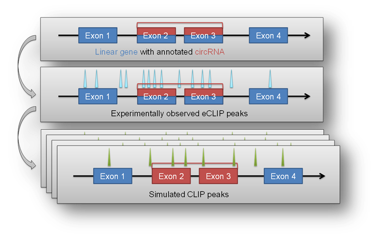
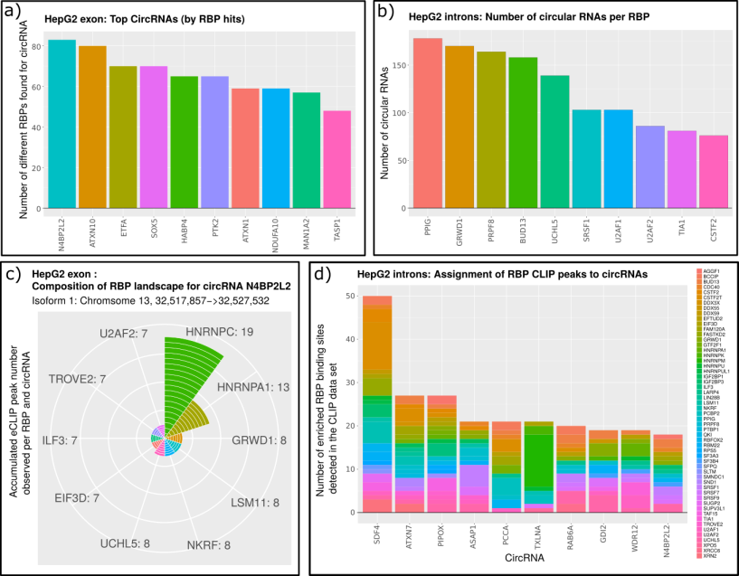

Enrichment module
********************************************************

The ``circtools enrichment`` module was implemented in order to combine circRNA data with positional data from other experiments, for example the `eCLIP <https://www.nature.com/articles/nmeth.3810>`_ approach. The setup uses detected circRNA back splice junctions and the corresponding location of circRNAs within the genome to test if positional features (e.g. eCLIP peaks) are significantly enriched within a circRNA compared to the remaining linear host gene.

This may give hints to potential RBP sponge functions of circRNAs when they show significant enrichment of eCLIP peaks in the circRNA portion of the host gene.

Background
----------------------------

Input
^^^^^^^^^^^^^

The circtools enrich module requires generally three types of input data:

* circRNA coordinates, e.g. from the circtools package itself or any other BED6-formatted circRNA list.
* a BED6-formatted file with coordinates of features of interest. E.g. RNA binding protein binding sites or any other sequence-based features that can be condensed into genomic coordinates
* A genome in FASTA format as well as a genome annotation in GTF format. Circtools works well and was tested with ENSEMBL-based genomes and annotations

How does it work
^^^^^^^^^^^^^^^^^^

In a first step the 'observed' distribution of features throughout the supplied circRNAs is calculated. This observed distribution is used as a baseline in the subsequent 'iteration' step. By employong the ``bedtools shuffle`` command the features are randomly distributed throughout the genome while keep the number and length of all features constant. After several hundred or thousand randomized iterations circtools counts the number of iterations in which more hits within the defined list of circRNAs are observed than in the initial, actual experimental observation. Circtools than computes the probability that a given number of hits is significantly higher than the simulated random distribution obtained by the random shuffling. The test is carried out for the circRNA and the corresponding host genes, therefore also allowing to distinguish between features enriched in the circRNA and possibly depleted in the circRNA host gene.

Required tools and packages
----------------------------

``circtools enrich`` depends on `bedtools <https://github.com/arq5x/bedtools2/releases>`_ as well as R and a some R packages for visualization purposes.

R packages:

* ggplot2
* ggrepel
* data.table
* reshape2
* plyr
* gridExtra

Python libraries:

* pybedtools >= 0.7.10
* statsmodels>=0.8.0

.. note:: The ``enrichment`` circtools module as well as all R dependencies are automatically installed during the circtools installation procedure.

General usage
--------------

A call to ``circtools enrich --help`` shows all available command line flags:

.. code-block:: bash

  usage: circtools [-h] -c CIRC_RNA_INPUT -b BED_INPUT -a ANNOTATION -g
                   GENOME_FILE [-o OUTPUT_DIRECTORY] [-i NUM_ITERATIONS]
                   [-p NUM_PROCESSES] [-t TMP_DIRECTORY] [-T THRESHOLD]
                   [-P PVAL] [-F OUTPUT_FILENAME] [-I INCLUDE_FEATURES]
                   [-k KEEP_TEMP]

  circular RNA RBP enrichment tools

  optional arguments:
    -h, --help            show this help message and exit

  Required options:
    -c CIRC_RNA_INPUT, --circ-file CIRC_RNA_INPUT
                          Path to the CircRNACount file generated by DCC
    -b BED_INPUT, --bed-input BED_INPUT
                          One or more BED files containing features to overlap
    -a ANNOTATION, --annotation ANNOTATION
                          Genome reference annotation file used to not shuffle
                          into intragenic regions
    -g GENOME_FILE, --genome GENOME_FILE
                          Genome file for use with bedtools shuffle. See
                          bedtools man page for details.

  Additional options:
    -o OUTPUT_DIRECTORY, --output OUTPUT_DIRECTORY
                          The output folder for files created by circtest
                          [default: .]
    -i NUM_ITERATIONS, --iterations NUM_ITERATIONS
                          Number of iterations for CLIP shuffling [default:
                          1000]
    -p NUM_PROCESSES, --processes NUM_PROCESSES
                          Number of threads to distribute the work to
    -t TMP_DIRECTORY, --temp TMP_DIRECTORY
                          Temporary directory used by pybedtools
    -T THRESHOLD, --threshold THRESHOLD
                          p-value cutoff
    -P PVAL, --pval PVAL  p-value cutoff
    -F OUTPUT_FILENAME, --output-filename OUTPUT_FILENAME
                          Defines the output file prefix [default: output]
    -I INCLUDE_FEATURES, --include-features INCLUDE_FEATURES
                          Defines the the features which should be used for
                          shuffling. May be specified multiple times. [default:
                          all - shuffle over the whole genome]
    -k KEEP_TEMP, --keep-temp KEEP_TEMP
                          Keep temporary files created by circtools/bedtools
                          [default: no]

Sample call
^^^^^^^^^^^^
.. code-block:: bash

    circtools enrich -c hepg2_flanking_introns_2k.bed -b AGGF1_HepG2_intersect.bed -a genes_and_introns.gtf -g hg38.chrom.sizes -i 2000 -I intron -p 20 -P 1 -T 1 -o out/ -F AGGF1_HepG2_intersect_intron_flanking -t /tmp/

This call to ``circtools enrich`` will produce output similar to the one shown below. The run time depends on the size of the circRNA dataset as well as the number of peaks used for the analysis.

Sample command line output
^^^^^^^^^^^^^^^^^^^^^^^^^^^
.. code-block:: bash

  2018-05-14 22:23:26,281 circtest 1.2.0-beta started
  2018-05-14 22:23:26,281 circtest command line: circtools enrich -c hepg2_flanking_introns_2k.bed -b AGGF1_HepG2_intersect.bed -a genes_and_introns.gtf -g hg38.chrom.sizes -i 2000 -I intron -p 20 -P 1 -T 1 -o out/ -F AGGF1_HepG2_intersect_intron_flanking -t /tmp/
  2018-05-14 22:23:26,292 bedtools v2.27.1 detected
  2018-05-14 22:23:26,292 Parsing annotation...
  2018-05-14 22:23:28,446 Found 285398 entries
  2018-05-14 22:23:28,446 Done parsing annotation
  2018-05-14 22:23:30,900 Parsing BED input file...
  2018-05-14 22:23:31,326 Done parsing BED input file:
  2018-05-14 22:23:31,326 => 61511 peaks, 28 nt average width
  2018-05-14 22:23:31,326 Parsing annotation...
  2018-05-14 22:23:31,992 Found 58051 entries
  2018-05-14 22:23:31,992 Done parsing annotation
  2018-05-14 22:23:33,322 Parsing circular RNA input file...
  2018-05-14 22:23:33,338 Done parsing circular RNA input file:
  2018-05-14 22:23:33,338 => 3122 circular RNAs, 1770 nt average (theoretical unspliced) length
  2018-05-14 22:23:33,699 Starting random shuffling of input peaks
  2018-05-14 22:23:33,702 Processing shuffling thread 1
  2018-05-14 22:23:33,702 Processing shuffling thread 2
  2018-05-14 22:23:33,702 Processing shuffling thread 3
  ....
  2018-05-14 22:27:05,808 Starting data acquisition from samplings
  2018-05-14 22:27:19,173 Processed intersections for iteration 1
  2018-05-14 22:27:19,259 Processed intersections for iteration 2
  2018-05-14 22:27:19,349 Processed intersections for iteration 3
  ....
  2018-05-14 22:59:47,184 Cleaning up... just a second
  2018-05-14 22:59:47,184 Starting permutation test phase 11
  2018-05-14 22:59:47,419 Permutation test iteration 1
  ....
  2018-05-14 23:02:27,368 Cleaning up temporary files
  2018-05-14 23:02:27,508 Deleting /scratch/global_tmp/AGGF1_HepG2_intersect_intron_flanking/pybedtools.2ux9j7r3.tmp
  2018-05-14 23:02:27,509 Deleting /scratch/global_tmp/AGGF1_HepG2_intersect_intron_flanking/pybedtools.zgy7g2yg.tmp
  2018-05-14 23:02:27,509 Deleting /scratch/global_tmp/AGGF1_HepG2_intersect_intron_flanking/pybedtools.elcwucww.tmp
  ....

Output produced by ``circtools enrich``
---------------------------------------
\*.csv
^^^^^^^^

The generated CSV file is the main output of ``circtools enrich``. It contains the data generated during the run and has the following fields:

* *circRNA_host_gene*: Name of the circRNA host gene
* *chr*: Chromsome location of the circRNA
* *start*: Absolute circRNA start location
* *stop*: Absolute circRNA end location
* *strand*: Strand of the circRNA
* *p-val_circular*: p-value for the enrichment of peaks within the given circRNA
* *raw_count_circ_rna*: How many simulated peaks have been counted
* *observed_input_peaks_circ_rna*: How many real, experimental peaks have been observed
* *length_circ_rna*: Length of the circRNA
* *length_normalized_count_circ_rna*: Lengt-normalized count of observed peaks
* *number_of_features_intersecting_circ*: How many featured are interesecting the circRNA (only ``-i``)
* *circ_rna_confidence_interval_0.05*: 0.05% confidence interval for the circRNA test
* *p-val_linear*: p-value for the enrichment of peaks within the linear host gene *excluding* the circRNA portion
* *raw_count_host_gene*: How many simulated peaks have been counted
* *observed_input_peaks_host_gene*: How many real, experimental peaks have been observed
* *length_host_gene_without_circ_rna*: Length of the host gene minus the circRNA length
* *length_normalized_count_host_gene*: Lengt-normalized count of observed peaks
* *number_of_features_intersecting_linear*:  How many featured are interesecting the host gene (only ``-i``)
* *host_gene_confidence_interval_0.05*: 0.05% confidence interval for the linear test
* *distance_normalized_counts*: Distance between the length-normalized counts of linear host gene and circRNA

+---------------------+-----+---------+---------+--------+-----------------+-----------------------+-----------------------------------+-------------------+--------------------------------------+------------------------------------------+------------------------------------------------+---------------+------------------------+------------------------------------+----------------------------------------+---------------------------------------+--------------------------------------------+----------------------------------------+------------------------------+
| circRNA_host_gene   | chr | start   | stop    | strand | p-val_circular  | raw_count_circ_rna    | observed_input_peaks_circ_rna     | length_circ_rna   | length_normalized_count_circ_rna     | number_of_features_intersecting_circ     | circ_rna_confidence_interval_0.05              | p-val_linear  | raw_count_host_gene    | observed_input_peaks_host_gene     | length_host_gene_without_circ_rna      | length_normalized_count_host_gene     | number_of_features_intersecting_linear     | host_gene_confidence_interval_0.05     | distance_normalized_counts   |
+=====================+=====+=========+=========+========+=================+=======================+===================================+===================+======================================+==========================================+================================================+===============+========================+====================================+========================================+=======================================+============================================+========================================+==============================+
| RERE                | 1   | 8539213 | 8541213 | -      | 0.0005          | 1                     | 1                                 | 2000              | 0.5                                  | 1                                        | (1.265882386853128e-05, 0.0027826398346596504) | 0             | 0                      | 59                                 | 450423                                 | 0                                     | 37                                         | (nan, 0.0018427397934069074)           | -0.5                         |
+---------------------+-----+---------+---------+--------+-----------------+-----------------------+-----------------------------------+-------------------+--------------------------------------+------------------------------------------+------------------------------------------------+---------------+------------------------+------------------------------------+----------------------------------------+---------------------------------------+--------------------------------------------+----------------------------------------+------------------------------+

\*.bed
^^^^^^^^
The generated BED files are holding the temporary annotation data created by ``circtools enrich``.

* *.gtf_features.bed*: Contains one row for each *feature* extract from the supplied genome annotatation (only in if ``-i`` is used)
* *.gtf_genes.bed*: Conatins one for for each gene entry from the supplied genome annotation
* *.bed_circles.bed*: Contains all supplied CircRNAs in BED format

\*.log
^^^^^^^^
The log file generated by ``circtools enrich``.

Additional graphical visualzation
---------------------------------------

Circtools is bundled with an additional R-script to post-process the raw data of the enrichment module. In order to be used with the visualization script, the ``enrich`` data has to be slightly preprocessed. The visualzation script is designed to work with multiple sets of peaks, i.e. multiple different eCLIP data sets.

Pre-processing
^^^^^^^^^^^^^^

In case an experiment has been performed with multiple eCLIP datasets the following command may be used to merge all runs into one CSV file with a new first column that contains the file name of the originating run (assuming 2000 iterations):

.. code-block:: bash

  awk '{{print FILENAME"\t"$0}}' *2000*.csv | sed 's/_2000_.*.csv//g' | grep -v circRNA_host_gene  > groups.csv

When slightly modified, the same command may be used to transform a single eCLIP experiment into a file ready for visualzation:

.. code-block:: bash

  awk '{{print YOUR_EXP_NAME_HERE"\t"$0}}' *2000*.csv | sed 's/_2000_.*.csv//g' | grep -v circRNA_host_gene  > groups.csv

Subsequently, the transformed data file may be used for visualzation:

Plotting
^^^^^^^^^^^^^^
.. code-block:: bash

  circtools_enrich_visualization.R groups_circ.csv 0.05 10 10 groups.pdf  "Your experiment description" colour False

Result
^^^^^^^^^^^

Visualization of results generated by the enrichment module. a) Top 10 circRNAs enriched (p<0.05) for eCLIP peaks for the data set. b) Top 10 RBPs with enrichment within the flanking introns (max. +/- 2kb) of the significantly enriched circRNA candidates c) Detailed view of the RBP eCLIP peaks enriched in the exons of isoform 1 of circN4BP2L2 d) Combined view of circRNAs enriched for RBP eCLIP peaks in the flanking introns and the landscape of the RBPs that are enriched within the flanking intronics regions.
