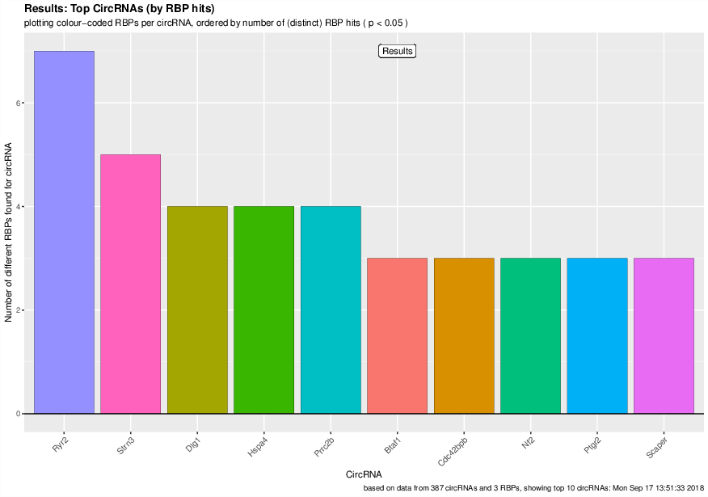
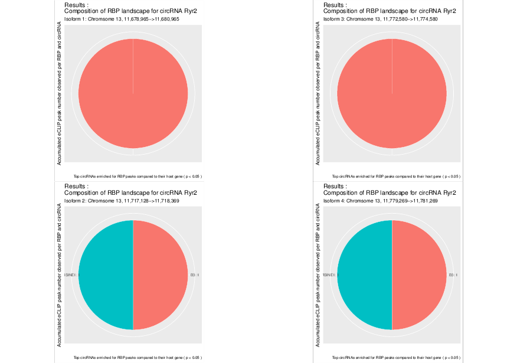

Enrichment module
********************************************************

The ``circtools enrichment`` module was implemented in order to combine circRNA data with positional data from other experiments, for example the `eCLIP <https://www.nature.com/articles/nmeth.3810>`_ approach. The setup uses detected circRNA back splice junctions and the corresponding location of circRNAs within the genome to test if positional features (e.g. eCLIP peaks) are significantly enriched within a circRNA compared to the remaining linear host gene.

.. image:: img/enrich_workflow.png

This may give hints to potential RBP sponge functions of circRNAs when they show significant enrichment of eCLIP peaks in the circRNA portion of the host gene.

Background
----------------------------

Input
^^^^^^^^^^^^^

The circtools enrich module requires generally three types of input data:

* circRNA coordinates, e.g. from the circtools package itself or any other BED6-formatted circRNA list.
* a BED6-formatted file with coordinates of features of interest. E.g. RNA binding protein binding sites or any other sequence-based features that can be condensed into genomic coordinates
* A genome in FASTA format as well as a genome annotation in GTF format. Circtools works well and was tested with ENSEMBL-based genomes and annotations

How does it work
^^^^^^^^^^^^^^^^^^

In a first step the 'observed' distribution of features throughout the supplied circRNAs is calculated. This observed distribution is used as a baseline in the subsequent 'iteration' step. By employing the ``bedtools shuffle`` command the features are randomly distributed throughout the genome while keep the number and length of all features constant. After several hundred or thousand randomized iterations circtools counts the number of iterations in which more hits within the defined list of circRNAs are observed than in the initial, actual experimental observation. Circtools than computes the probability that a given number of hits is significantly higher than the simulated random distribution obtained by the random shuffling. The test is carried out for the circRNA and the corresponding host genes, therefore also allowing to distinguish between features enriched in the circRNA and possibly depleted in the circRNA host gene.

Required tools and packages
----------------------------

``circtools enrich`` depends on `bedtools <https://github.com/arq5x/bedtools2/releases>`_ as well as R and a some R packages for visualization purposes.

R packages:

* ggplot2
* ggrepel
* data.table
* reshape2
* plyr
* gridExtra

Python libraries:

* pybedtools >= 0.7.10
* statsmodels>=0.8.0

.. note:: The ``enrichment`` circtools module as well as all R dependencies are automatically installed during the circtools installation procedure.

General usage
--------------

A call to ``circtools enrich --help`` shows all available command line flags:

.. code-block:: bash

  usage: circtools [-h] -c CIRC_RNA_INPUT -b BED_INPUT -a ANNOTATION -g
                   GENOME_FILE [-o OUTPUT_DIRECTORY] [-i NUM_ITERATIONS]
                   [-p NUM_PROCESSES] [-t TMP_DIRECTORY] [-T THRESHOLD]
                   [-P PVAL] [-F OUTPUT_FILENAME] [-I INCLUDE_FEATURES]
                   [-k KEEP_TEMP]

  circular RNA RBP enrichment tools

  optional arguments:
    -h, --help            show this help message and exit

  Required options:
    -c CIRC_RNA_INPUT, --circ-file CIRC_RNA_INPUT
                          Path to the CircRNACount file generated by DCC
    -b BED_INPUT, --bed-input BED_INPUT
                          One or more BED files containing features to overlap
    -a ANNOTATION, --annotation ANNOTATION
                          Genome reference annotation file used to not shuffle
                          into intragenic regions
    -g GENOME_FILE, --genome GENOME_FILE
                          Genome file for use with bedtools shuffle. See
                          bedtools man page for details.

  Additional options:
    -o OUTPUT_DIRECTORY, --output OUTPUT_DIRECTORY
                          The output folder for files created by circtest
                          [default: .]
    -i NUM_ITERATIONS, --iterations NUM_ITERATIONS
                          Number of iterations for CLIP shuffling [default:
                          1000]
    -p NUM_PROCESSES, --processes NUM_PROCESSES
                          Number of threads to distribute the work to
    -t TMP_DIRECTORY, --temp TMP_DIRECTORY
                          Temporary directory used by pybedtools
    -T THRESHOLD, --threshold THRESHOLD
                          p-value cutoff
    -P PVAL, --pval PVAL  p-value cutoff
    -F OUTPUT_FILENAME, --output-filename OUTPUT_FILENAME
                          Defines the output file prefix [default: output]
    -I INCLUDE_FEATURES, --include-features INCLUDE_FEATURES
                          Defines the the features which should be used for
                          shuffling. May be specified multiple times. [default:
                          all - shuffle over the whole genome]
    -k KEEP_TEMP, --keep-temp KEEP_TEMP
                          Keep temporary files created by circtools/bedtools
                          [default: no]

Generating necessary input data files
^^^^^^^^^^^^^^^^^^^^^^^^^^^^^^^^^^^^^^^^^

In addition to input data produced by the detection and reconstruct module, the enrichment module requires a few processing steps. For our example we employ the circRNAs detected in the murine heart and are interested in possible enrichment of repeat in the flanking intron of those circRNAs. Therefore, as a first step the flanking introns need to be compiled from the circRNA coordinates provided by the detect module.

.. code-block:: bash

    circtools_generate_flanking_introns.py -g /scratch/tjakobi/circtools_workflow/genes_and_introns.gtf -d /scratch/tjakobi/circtools_workflow/workflow/circtools/01_detect/CircCoordinates > /scratch/tjakobi/circtools_workflow/murine_flanking_introns.bed

Additionally, the shuffling algorithm of ``bedtools`` requires knowledge of chromosome sizes. For the mouse genome, a sample file for those length can be easily downloaded:

.. code-block:: bash

    wget https://data.dieterichlab.org/s/mm10_chrom_sizes/download -O mm10.chrom.sizes

In order to provide a working example of reasonable size we do not use the full set of repeats as provided by the UCSC genome browser but only the 3 most-common ones, i.e. :

* AT_rich
* B3
* RSINE1

.. code-block:: bash

    wget https://data.dieterichlab.org/s/repeat_selection_mm10/download -O repeat_selection_mm10.tar.bz2
    tar -jxvf repeat_selection_mm10.tar.bz2

After unzipping the downloaded file, the folder ``repeats/`` contains BED files with coordinates of the three aforementioned repeat categories. Those files will be used as input in the next step. The circtools enrich module is able to work with arbitrary features of a GTF annotation file. However, our aim is to search in introns for enrichment and introns are not part of normal ENSEMBL GTF annotation files. circtools includes a script that easily converts ENSEMBL GTF files in GTF files enriched with intron information.

.. code-block:: bash

    mkdir 06_enrich/
    cd 06_enrich/

    # download build 90 annotation
    wget ftp://ftp.ensembl.org/pub/release-90/gtf/mus_musculus/Mus_musculus.GRCm38.90.gtf.gz

    # unzip and add introns
    gzip -d Mus_musculus.GRCm38.90.gtf.gz
    circtools_generate_intron_gtf.sh Mus_musculus.GRCm38.90.gtf

The resulting files, ``genes_and_introns.gtf`` will now serve as replacement for the standard ENSEMBL annotation in the module call.

Calling the reconstruct module via wrapper
^^^^^^^^^^^^^^^^^^^^^^^^^^^^^^^^^^^^^^^^^^^

.. code-block:: bash

    cd 06_enrich/

    # download wrapper for STAR
    wget https://raw.githubusercontent.com/dieterich-lab/bioinfo-scripts/master/slurm_circtools_enrich_intron.sh
    chmod 755 slurm_circtools_enrich_intron.sh

    parallel -j1 slurm_circtools_enrich_intron.sh /scratch/tjakobi/circtools_workflow/workflow/circtools/06_enrich/mm10.chrom.sizes /scratch/tjakobi/circtools_workflow/workflow/circtools/06_enrich/genes_and_introns.gtf /scratch/tjakobi/circtools_workflow/workflow/circtools/06_enrich/repeats/{}.bed /scratch/tjakobi/circtools_workflow/workflow/circtools/06_enrich/murine_flanking_introns.bed {} /scratch/tjakobi/circtools_workflow/workflow/circtools/06_enrich/output/ 2000 /scratch/global_tmp/{}/ :::: /scratch/tjakobi/circtools_workflow/workflow/circtools/06_enrich/repeats/repeats_selected.list

Manual module call
^^^^^^^^^^^^^^^^^^^

Below a sample single call of circtools enrich without using the wrapper script:

.. code-block:: bash

    circtools enrich -c /scratch/tjakobi/circtools_workflow/workflow/circtools/06_enrich/murine_flanking_introns.bed -b /scratch/tjakobi/circtools_workflow/workflow/circtools/06_enrich/repeats/AT_rich.bed -a /scratch/tjakobi/circtools_workflow/workflow/circtools/06_enrich/genes_and_introns.gtf -g /scratch/tjakobi/circtools_workflow/workflow/circtools/06_enrich/mm10.chrom.sizes -i 2000 -I intron -p 20 -P 1 -T 1 -o /scratch/tjakobi/circtools_workflow/workflow/circtools/06_enrich/output// -F AT_rich -t /scratch/global_tmp/AT_rich/

This call to ``circtools enrich`` will produce output similar to the one shown below. The run time depends on the size of the circRNA dataset as well as the number of peaks used for the analysis.

Command line output
^^^^^^^^^^^^^^^^^^^^^^^^^^^
.. code-block:: bash

    2018-09-17 11:13:16,166 circtools 1.1.0.6 started
    2018-09-17 11:13:16,166 circtools command line: /home/tjakobi//.local/bin/circtools enrich -c /scratch/tjakobi/circtools_workflow/workflow/circtools/06_enrich/murine_flanking_introns.bed -b
     /scratch/tjakobi/circtools_workflow/workflow/circtools/06_enrich/repeats/AT_rich.bed -a /scratch/tjakobi/circtools_workflow/workflow/circtools/06_enrich/genes_and_introns.gtf -g /scratch/tjakobi/circtools_workflow/workflow/circtools/06_enrich/mm10.chrom.sizes -i 2000 -I intron -p 20 -P 1 -T 1 -o /scratch/tjakobi/circtools_workflow/workflow/circtools/06_enrich/output// -F AT_rich -t /scratch/global_tmp/AT_rich//
    2018-09-17 11:13:16,177 bedtools v2.27.1 detected
    2018-09-17 11:13:16,177 Parsing annotation...
    2018-09-17 11:13:17,864 Found 256488 entries
    2018-09-17 11:13:17,865 Done parsing annotation
    2018-09-17 11:13:20,126 Parsing BED input file...
    2018-09-17 11:13:21,207 Done parsing BED input file:
    2018-09-17 11:13:21,207 => 228756 peaks, 33 nt average width
    2018-09-17 11:13:21,207 Parsing annotation...
    2018-09-17 11:13:21,727 Found 52636 entries
    2018-09-17 11:13:21,728 Done parsing annotation
    2018-09-17 11:13:22,777 Parsing circular RNA input file...
    2018-09-17 11:13:22,787 Done parsing circular RNA input file:
    2018-09-17 11:13:22,788 => 2522 circular RNAs, 1801 nt average (theoretical unspliced) length
    2018-09-17 11:13:23,057 Starting random shuffling of input peaks
    2018-09-17 11:13:23,059 Processing shuffling thread 1
    2018-09-17 11:13:23,059 Processing shuffling thread 26
    [output cut]
    2018-09-17 11:35:14,025 Permutation test iteration 1998
    2018-09-17 11:35:14,043 Permutation test iteration 1991
    2018-09-17 11:35:14,172 Permutation test iteration 2000
    2018-09-17 11:35:14,198 Permutation test iteration 1993
    2018-09-17 11:35:14,221 Permutation test iteration 1995
    2018-09-17 11:35:14,381 Permutation test iteration 1997
    2018-09-17 11:35:14,578 Permutation test iteration 1999
    2018-09-17 11:35:17,547 Cleaning up... just a second
    2018-09-17 11:35:18,740 Cleaning up temporary files
    2018-09-17 11:35:20,552 Deleting /scratch/global_tmp/AT_rich/pybedtools.knohds5y.tmp
    2018-09-17 11:35:20,553 Deleting /scratch/global_tmp/AT_rich/pybedtools.j0mwk09_.tmp
    2018-09-17 11:35:20,553 Deleting /scratch/global_tmp/AT_rich/pybedtools.85vjrbnw.tmp
    2018-09-17 11:35:20,553 Deleting /scratch/global_tmp/AT_rich/pybedtools.jli7p0je.tmp
    2018-09-17 11:35:20,553 Deleting /scratch/global_tmp/AT_rich/pybedtools.4vz84ujl.tmp
    2018-09-17 11:35:20,560 Done

Output produced by ``circtools enrich``
---------------------------------------
\*.csv
^^^^^^^^

The generated CSV file is the main output of ``circtools enrich``. It contains the data generated during the run and has the following fields:

* *circRNA_host_gene*: Name of the circRNA host gene
* *chr*: Chromosome location of the circRNA
* *start*: Absolute circRNA start location
* *stop*: Absolute circRNA end location
* *strand*: Strand of the circRNA
* *p-val_circular*: p-value for the enrichment of peaks within the given circRNA
* *raw_count_circ_rna*: How many simulated peaks have been counted
* *observed_input_peaks_circ_rna*: How many real, experimental peaks have been observed
* *length_circ_rna*: Length of the circRNA
* *length_normalized_count_circ_rna*: Lengt-normalized count of observed peaks
* *number_of_features_intersecting_circ*: How many featured are interesecting the circRNA (only ``-i``)
* *circ_rna_confidence_interval_0.05*: 0.05% confidence interval for the circRNA test
* *p-val_linear*: p-value for the enrichment of peaks within the linear host gene *excluding* the circRNA portion
* *raw_count_host_gene*: How many simulated peaks have been counted
* *observed_input_peaks_host_gene*: How many real, experimental peaks have been observed
* *length_host_gene_without_circ_rna*: Length of the host gene minus the circRNA length
* *length_normalized_count_host_gene*: Lengt-normalized count of observed peaks
* *number_of_features_intersecting_linear*:  How many featured are interesecting the host gene (only ``-i``)
* *host_gene_confidence_interval_0.05*: 0.05% confidence interval for the linear test
* *distance_normalized_counts*: Distance between the length-normalized counts of linear host gene and circRNA

+---------------------+-----+---------+---------+--------+-----------------+-----------------------+-----------------------------------+-------------------+--------------------------------------+------------------------------------------+------------------------------------------------+---------------+------------------------+------------------------------------+----------------------------------------+---------------------------------------+--------------------------------------------+----------------------------------------+------------------------------+
| circRNA_host_gene   | chr | start   | stop    | strand | p-val_circular  | raw_count_circ_rna    | observed_input_peaks_circ_rna     | length_circ_rna   | length_normalized_count_circ_rna     | number_of_features_intersecting_circ     | circ_rna_confidence_interval_0.05              | p-val_linear  | raw_count_host_gene    | observed_input_peaks_host_gene     | length_host_gene_without_circ_rna      | length_normalized_count_host_gene     | number_of_features_intersecting_linear     | host_gene_confidence_interval_0.05     | distance_normalized_counts   |
+=====================+=====+=========+=========+========+=================+=======================+===================================+===================+======================================+==========================================+================================================+===============+========================+====================================+========================================+=======================================+============================================+========================================+==============================+
| RERE                | 1   | 8539213 | 8541213 | -      | 0.0005          | 1                     | 1                                 | 2000              | 0.5                                  | 1                                        | (1.265882386853128e-05, 0.0027826398346596504) | 0             | 0                      | 59                                 | 450423                                 | 0                                     | 37                                         | (nan, 0.0018427397934069074)           | -0.5                         |
+---------------------+-----+---------+---------+--------+-----------------+-----------------------+-----------------------------------+-------------------+--------------------------------------+------------------------------------------+------------------------------------------------+---------------+------------------------+------------------------------------+----------------------------------------+---------------------------------------+--------------------------------------------+----------------------------------------+------------------------------+

\*.bed
^^^^^^^^
The generated BED files are holding the temporary annotation data created by ``circtools enrich``.

* *.gtf_features.bed*: Contains one row for each *feature* extract from the supplied genome annotatation (only in if ``-i`` is used)
* *.gtf_genes.bed*: Conatins one for for each gene entry from the supplied genome annotation
* *.bed_circles.bed*: Contains all supplied CircRNAs in BED format

\*.log
^^^^^^^^
The log file generated by ``circtools enrich``.

Additional graphical visualization
---------------------------------------

Circtools is bundled with an additional R-script to post-process the raw data of the enrichment module. In order to be used with the visualization script, the ``enrich`` data has to be slightly preprocessed. The visualization script is designed to work with multiple sets of peaks, i.e. multiple different eCLIP data sets.

Pre-processing
^^^^^^^^^^^^^^

In case of the example used throughout this tutorial, the experiment has been performed with multiple repeat classes and the following command may be used to merge all runs into one CSV file with a new first column that contains the file name of the originating run (assuming 2000 iterations):

.. code-block:: bash

    awk -F '\t' '{{print FILENAME"\t"$0}}' *.csv | sed 's/_.*2000_.*.csv//g' | grep -v circRNA_host_gene > ../results.csv

Subsequently, the transformed data file may be used for visualization:

Plotting
^^^^^^^^^^^^^^
.. code-block:: bash

    circtools_enrich_visualization.R results.csv 0.05 10 10 results.pdf "Results" colour False

Visualized results
^^^^^^^^^^^^^^^^^^^

Visualization of the results generated by the enrichment module for the Jakobi 2016 data set. The is sample experiment looks at enriched repeats in the flanking introns of the detect circRNAs.

**1)** Results: Number of circular RNAs per repeat category (p<0.05)

.. image:: img/results-0.png

**2)** Top 3 repeat categories with enrichment within the flanking introns (max. +/- 2kb) of the significantly enriched circRNA candidates

**3)** Detailed view of the repeat "peaks" enriched in the flanking introns of isoform 1 of circRyr2.

