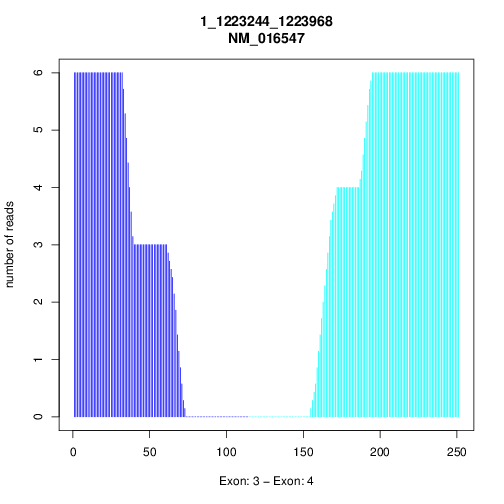
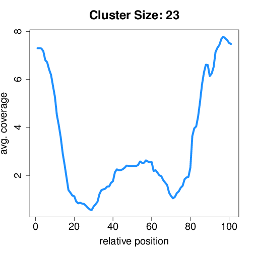
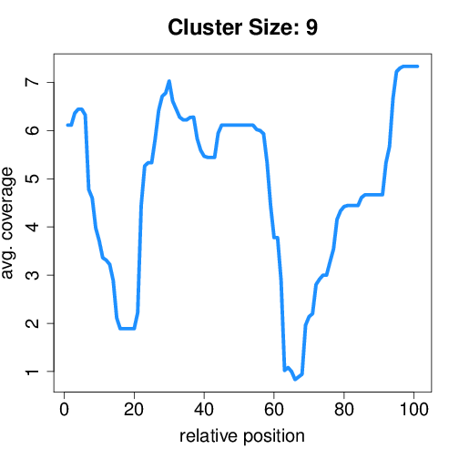
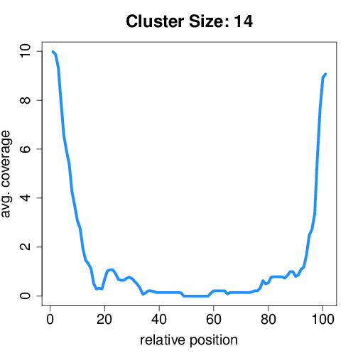
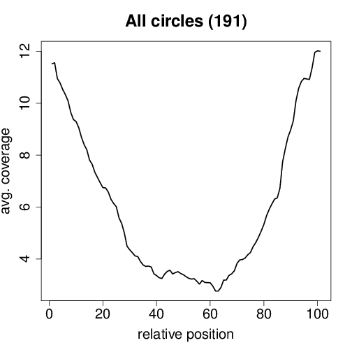

Reconstruction module
********************************************************

The circtools reconstruct module is based on FUCHS (FUll circular RNA CHaracterization from RNA-Seq), a Python program designed to fully characterize circular RNAs. It uses a list of circular RNAs and reads spanning the back-splice junction as well as BAM files containing the mappings of all reads (alternatively of all chimeric reads).

The reads from each circle are extracted by the reconstruction module and saved in an individual BAM files. Based on these BAM files, circtools will detect alternative splicing within the same circle boundaries, summarize different circular isoforms from the same host-gene, and generate coverage plots for each circRNA. It will also cluster circles based on their coverage profile. These results can be used to identify potential false positive circRNAs.

Manual installation instructions
--------------------------------

Required tools and packages
^^^^^^^^^^^^^^^^^^^^^^^^^^^^

FUCHS dependes on **bedtools (>= 2.27.0)**, **samtools (>= 1.3.1)**,  **Python (> 2.7; pysam>=0.9.1.4, pybedtools>=0.7.8, numpy>=1.11.2, pathos>=0.2.1)**, and **R(>= 3.2.0; amap, Hmisc, gplots)**. All Python an R dependencies will be installed automatically when installing FUCHS. Please make sure to have the correct versions of bedtools and samtools in your ``$PATH``.

Obtaining the source code
^^^^^^^^^^^^^^^^^^^^^^^^^

Cloning of the repository:

.. code-block:: bash

  $ git clone git@github.com:dieterich-lab/FUCHS.git

  $ cd FUCHS

Installation of FUCHS
^^^^^^^^^^^^^^^^^^^^^
.. code-block:: bash

  $ python setup.py install --user

  # This will install a FUCHS binary in $HOME/.local/bin/
  # make sure this folder is in your $PATH

  # Check the installation:

  $ FUCHS --help

Usage
------

In order to characterize circRNAs from RNA-seq data the following steps are necessary:

1. Mapping of RNA-seq data from quality checked FASTQ files with either STAR , BWA, TopHat-Fusion

2. Detection circRNAs using circtools detect, CIRI, CIRCfinder or CIRCexplorer

3. Run circtools reconstruct

.. note:: Currently only the combination STAR + DCC has been tested; other setups are under development

Step by step tutorial
---------------------
In this tutorial we will be using HEK293 data available in this repository and use STAR with DCC to detect circular RNAs

Mapping of RNA-Seq data and detection of circRNAs
^^^^^^^^^^^^^^^^^^^^^^^^^^^^^^^^^^^^^^^^^^^^^^^^^^

Please see the documentation of `circtools detect <Detect.html>`_ for instructions how to pre-process the data.

Prepare input data for reconstruction module
^^^^^^^^^^^^^^^^^^^^^^^^^^^^^^^^^^^^^^^^^^^^

The files  ``chimeric.sam``, ``mate1.chimeric.sam``, and ``mate2.chimeric.sam`` have to be merged for the reconstruction module (not necessary if circles were detected using BWA/CIRI):

.. code-block:: bash

  # convert SAM to BAM
  $ samtools view -Sb -o sample sample/Chimeric.out.sam
  $ samtools view -Sb -o sample.1 sample.1/Chimeric.out.sam
  $ samtools view -Sb -o sample.2 sample.2/Chimeric.out.sam

  # sort both BAM files
  $ samtools sort -o sample.sorted.bam sample.bam
  $ samtools sort -o sample.1.sorted.bam sample.1.bam
  $ samtools sort -o sample.2.sorted.bam sample.2.bam

  # create an index for both BAM files
  $ samtools index sample.sorted.bam
  $ samtools index sample.1.sorted.bam
  $ samtools index sample.2.sorted.bam

  # merge both mate BAM files into one new BAM file
  $ samtools merge merged_sample.bam sample.sorted.bam sample.1.sorted.bam sample.2.sorted.bam

  # re-index the newly aggregated BAM file
  $ samtools index merged_sample.bam

Running the reconstruction module
^^^^^^^^^^^^^^^^^^^^^^^^^^^^^^^^^^

``circtools reconstruct`` starts the pipeline which will extract reads, check mate status, detect alternative splicing events, classify different isoforms, run_primer_design coverage profiles, and cluster circRNAs based on coverage profiles

.. code-block:: bash

  # using STAR/circtools detect Input
  $ circtools reconstruct -r 2 -q 2 -p ensembl -e 2 -T ~/tmp 
	  -D CircRNACount 
	  -J sample/Chimeric.out.junction 
	  -F sample.1/Chimeric.out.junction 
	  -R sample.2/Chimeric.out.junction.fixed 
	  -B merged_sample.sorted.bam 
	  -A [annotation].bed 
	  -N sample 

  # if BWA/CIRI was used, use -C to specify the circIDS list (omit -D, -J, -F and -R)
  # For details on the parameters please refer to the help page:
  $ circtools reconstruct --help

Optional reconstruct module
^^^^^^^^^^^^^^^^^^^^^^^^^^^

The additional module ``denovo_circle_structure_parallel`` can be employed to obtain a more refined circle reconstruction based on intron signals. The circRNA-separated bamfiles (step 2) are the only input required for the module. If an annotation file is supplied, unsupported exons will be reported with a score of 0, if no annotation file is supplied, unsupported exons will not be reported.

.. code-block:: bash

  $ denovo_circle_structure_parallel -c 18 -A [annotatation].bed -I output/folder -N sample

  # output/folder corresponds to the output directory of the circtools reconstruct pipeline
  # sample corresponds to your sample name, just as specified for the pipeline

Required input data
--------------------

circRNA IDs
^^^^^^^^^^^^

CircRNA data data can be provided via a generic table with the structure found below:

==================== ==========================================================================================
 circID               read1,read2,read3
==================== ==========================================================================================
 1:3740233\|3746181  MISEQ:136:000000000-ACBC6:1:2107:10994:20458,MISEQ:136:000000000-ACBC6:1:1116:13529:8356
 1:8495063\|8614686  MISEQ:136:000000000-ACBC6:1:2118:9328:9926
==================== ==========================================================================================

The first column contains the circleRNA ID formated as folllowed **chr:start|end**. The second column is a comma separated list of read names spanning the back-splice junction.

BAM input files
^^^^^^^^^^^^^^^^

Alignment files produced by any suitable read mapping tool. The files *have to* contain all chimerically mapped reads and *may* also contain linearly mapped reads.

BED annotation file
^^^^^^^^^^^^^^^^^^^^

A BED file in BED6 format. The name should contain a gene name or gene ID and the exon_number. You can specify how the name should be processed using -p (platform), -s (character used to separate name and exon number) and -e (exon_index).

====   ===========    =============     ===================================   =======  ======
Chr      Start            End               Name                               Score   Strand
====   ===========    =============     ===================================   =======  ======
 1      67092175        67093604         NR_075077_exon_0_0_chr1_67092176_r     0       \-
 1      67096251        67096321         NR_075077_exon_1_0_chr1_67096252_r     0       \-
 1      67103237        67103382         NR_075077_exon_2_0_chr1_67103238_r     0       \-
====   ===========    =============     ===================================   =======  ======

Output produced by circtools reconstruct
----------------------------------------

\*.alternative_splicing.txt
^^^^^^^^^^^^^^^^^^^^^^^^^^^

This file summarizes the relationship of different circRNAs derived from the same host-gene. A sample file structure given below:

=============  ============================================================    =========================================  =========   ===========  =============================================
Transcript      circles                                                        same_start                                 same_end    overlapping  within
=============  ============================================================    =========================================  =========   ===========  =============================================
NM_016287	1:20749723-20773610                                            .                                           .          .            .
NM_005095	1:35358925-35361789,1:35381259-35389082,1:35381259-35390098    1:35381259-35389082|1:35381259-35390098,    .          .            .
NM_001291940    1:236803428-236838599,1:236806144-236816543                    .                                           .          .            1:236803428-236838599|1:236806144-236816543,
=============  ============================================================    =========================================  =========   ===========  =============================================

**Description of the data columns:**

* *Transcript*: Transcript name as defined by the bed-annotation file
* *circles*: Comma-separated list of circRNA ids derived from this transcript
* *same_start*: Comma-separated list of circRNA pairs separated by ``|``. Pairs in this column share the same start coordinates. A "." indicates that there are no circle pairs that share the same start coordinates.
* *same_end*: Same as *same_start*, only now, circle pairs share the same end coordinates.
* *overlapping*: Comma-separated list of circRNA pairs separated by ``|``. Pairs in this column share neither start nor end coordinates, but their relation is such that: start.x < start.y && end.x < end.y && start.y < end.x
* *within*: Same as *overlapping*, but circRNA pairs have the following relation: start.x < start.y && end.x > end.y

\*.exon_counts.bed
^^^^^^^^^^^^^^^^^^^^^^^^^^

These files are BED formatted and describe the exon-structure. The files can be loaded into any genome browser. Each line corresponds to a circRNA.

=====  ============  =============    ============    =============    =======   ======== =========  ======= ===========  ==============  =====================
Chr    Circle Start   Circle  End      Transcript     Num of Reads     Strand      Start   End        Color  Num of Exon  Exon Lengths     Relative Exon Starts
=====  ============  =============    ============    =============    =======   ======== =========  ======= ===========  ==============  =====================
chr1    35358925        35361789        NM_005095       9               \+       35358925 35361789   0,255,0  3           521,61,170      0,2269,2694
chr1    20749723        20773610        NM_016287       4               \-       20749723 20773610   0,255,0  4           159,90,143,159  0,7443,21207,23728
=====  ============  =============    ============    =============    =======   ======== =========  ======= ===========  ==============  =====================

**Description of the data columns:**

* *Chr*: Chromosome of circRNA
* *Circle Start*: The 5' site of the chimeric junction. This is relative to the reference strand, i.e. start < end! The location is 1-index based
* *Cirlce End*: The 3' site of the chimeric junction. This is relative to the reference strand, i.e. start < end! The location is 0-index based
* *Transcript*: Transcript name as defined by the bed-annotation file
* *Num of Reads* : Number of reads supporting this chimeric junction, in other words, reads that are chimerically mapped to this junction
* *Strand*: Strand of the host-gene
* *Start*: Copied *Circle Start* to stay conform with BED12 format
* *End*: Copied *Circle End* to stay conform with BED12 format
* *Color*: pre defined color the exons will show up in the genome viewer (0,255,0 -> green)
* *Num of Exon*: Number of exons in this circRNA consists of
* *Exon Lengths*: Comma-separated list of the length of each exon
* *Relative Exon Starts*: Comma-separated list of the relative starting positions of the exons within the circle boundaries.

\*.exon_counts.txt
^^^^^^^^^^^^^^^^^^^^^^^^^^^^^
This file contains similar information as the previous file, just more detailed information on the exons. Each line corresponds to one exon.

======= =====================  ================ ============  ========== =====  ============   ============= ======= =============   ==============  ===========     ========= ========
sample   circle_id               transcript_id   other_ids       exon_id chr     start           end          strand  exon_length     unique_reads    fragments       number\+ number\-
======= =====================  ================ ============  ========== =====  ============   ============= ======= =============   ==============  ===========     ========= ========
hek293   1:35358925-35361789     NM_005095       NM_005095       2       1       35358924        35359446        \+       522          9               9               4        5
hek293   1:35358925-35361789     NM_005095       NM_005095       3       1       35361193        35361255        \+       62           3               3               1        2
hek293   1:35358925-35361789     NM_005095       NM_005095       4       1       35361618        35361789        \+       171          9               9               4        5
hek293   1:20749723-20773610     NM_016287       NM_016287       3       1       20749722        20749882        \-       160          4               4               4        0
hek293   1:20749723-20773610     NM_016287       NM_016287       4       1       20757165        20757256        \-       91           1               1               1        0
hek293   1:20749723-20773610     NM_016287       NM_016287       5       0       0               0               \0       0            0               0               0        0
hek293   1:20749723-20773610     NM_016287       NM_016287       6       0       0               0               \0       0            0               0               0        0
hek293   1:20749723-20773610     NM_016287       NM_016287       7       1       20770929        20771073        \-       144          1               1               1        0
hek293   1:20749723-20773610     NM_016287       NM_016287       8       1       20773450        20773610        \-       160          4               4               4        0
======= =====================  ================ ============  ========== =====  ============   ============= ======= =============   ==============  ===========     ========= ========

**Description of the data columns:**

* *sample*: Sample name as specified by the user. This is useful if the user wants to merge files from different samples
* *circle_id*: circRNA-ID. The circleID is formatted to be copy and pasted to a genome browser for easy access
* *transcript_id*: Transcript name as defined by the bed-annotation file. This is the best fitting transcript. i.e. the splicing variants that contains the most exons that are actually covered
* *other_ids*: Alternative Transcript names that are either just as fitting, or contain more or less exons as supported by reads
* *exon_id*: Exon number relative to the host-gene of the circularized exon. One circle may have more than one exon. These will be listed as consecutive lines
* *chr*: Chromosome the circRNA is located on
* *start*: 5' start of the exon, relative to the reference strand, 0-based
* *end*: 3' end of the exon, relative to the reference start, 0-based
* *strand*: Strand of the host-gene
* *exon_length*: Length of the current exon
* *unique_reads*: Number of unique reads associated with the chimeric junction. When the data is paired end, then both ends are considered as separate reads.
* *fragments*: Number of broken fragments aligning to the circle
* *number\+*: Number of reads spanning the chimeric junction on the forward strand
* *number\-*: Number of reads spanning the chimeric junction on the reverse strand (if reads are only from one strand, this may indicate that there is a sequencing bias)

\*.mate_status.txt
^^^^^^^^^^^^^^^^^^^

This output file contains the results of analyzing the amount of how often each fragment spans a chimeric junction. A fragment can either span the chimeric junction once (single), only one end spans the junction, twice (double) both ends span the chimeric junction, or more than twice (undefined).

=====================  ================ =============   ============   ============    ======= ======== ==========
circle_id               transcript_ids  num_reads       min_length      max_length      single  double  undefined
=====================  ================ =============   ============   ============    ======= ======== ==========
1_20749723_20773610     NM_016287       4               790              790             4       0       0
1_35358925_35361789     NM_005095       9               754              754             9       0       0
=====================  ================ =============   ============   ============    ======= ======== ==========

**Description of the data columns:**

* *circle_id*: The circRNA ID in the form *chr_start_stop*
* *transcript_ids*: Names of the corresponding annotated transcript IDs
* *num_reads*: Total number of reads for this circRNA
* *min_length* Minimal length of exons intersecting the circRNA
* *max_length*: Maximal length of exons intersecting the circRNA (if only one exon same as *min_length*)
* *single*: Number of single break points for this circRNA
* *double*: Number of double break points for this circRNA
* *undefined*: Number of undefined break points for this circRNA

\*.skipped_exons.bed
^^^^^^^^^^^^^^^^^^^^^

=====  ==============  ============    ==============  ======= ======= =============== ============   ========= ========== ============ =============
Chr     Circle-Start    Circle-End      Transcript      Ratio  Strand   Intron-Start    Intron-End     Color    NumExon    IntronLength RelativeStart
=====  ==============  ============    ==============  ======= ======= =============== ============   ========= ========== ============ =============
chr5    178885614       178931326       NM_030613       60.0    .       178913072       178931236      255,0,0  3          1,146,1      0,30950,45711
chr6    161034259       161049979       NM_001291958    40.0    .       161049332       161049852      255,0,0  3          1,520,1      0,15073,15719
=====  ==============  ============    ==============  ======= ======= =============== ============   ========= ========== ============ =============

**Description of the data columns:**

* *Chr*: Chromosome of circRNA
* *Circle-Start*: The 5' site of the chimeric junction. This is relative to the reference strand, i.e. start < end! The location is 1-index based
* *Cirlce-End*: The 3' site of the chimeric junction. This is relative to the reference strand, i.e. start < end! The location is 0-index based
* *Transcript*: Transcript name as defined by the BED annotation file
* *Ratio*: Ratio of reads of this skipped exon
* *Strand*: Strand of the host-gene
* *Intron-Start*: The 5' site of intron. This is relative to the reference strand, i.e. start < end! The location is 1-index based
* *Intron-End*: The 3' site of the intron. This is relative to the reference strand, i.e. start < end! The location is 0-index based
* *Color*: pre defined color the exons will show up in the genome viewer (0,255,0 -> green)
* *Num of Exon*: Number of exons in this circRNA consists of
* *IntronLengths*: Comma-separated list of the length of each intron
* *RelativeStart*: Comma-separated list of the relative starting positions of the introns within the circle boundaries.

\*.skipped_exons.txt
^^^^^^^^^^^^^^^^^^^^^^^^^^^^^^

=====================   ==============  ======================  =============================================   ======================================================================================================================================   =============   ===========
circle_id               transcript_id   skipped_exon            intron                                          read_names                                                                                                                               splice_reads    exon_reads
=====================   ==============  ======================  =============================================   ======================================================================================================================================   =============   ===========
5_178885614_178931326   NM_030613       5:178916564-178916710   set\(\[\(\'5\', 178913072, 178931236\)\]\)      MISEQ:136:000000000-ACBC6:1:2103:10044:24618,MISEQ:136:000000000-ACBC6:1:2115:19571:6931,MISEQ:136:000000000-ACBC6:1:1119:25537:8644     3               5
6_161034259_161049979   NM_001291958    6:161049332-161049852   set\(\[\(\'6\', 161049332, 161049852\)\]\)      MISEQ:136:000000000-ACBC6:1:1113:25288:9067,MISEQ:136:000000000-ACBC6:1:2116:11815:3530                                                  2               5
=====================   ==============  ======================  =============================================   ======================================================================================================================================   =============   ===========

**Description of the data columns:**

* *Chr*: Chromosome of circRNA
* *Transcript_id*: Transcript name as defined by the BED annotation file
* *Skipped_exon*: Coordinates of the skipped exon
* *Intron*: Set of introns
* *read_names*: Unique read names identifying this skipped exon
* *splice_reads*: Number of reads supporting the splice site
* *exon_reads*: Number of reads supporting the exon

\*.sample_name.exon_chain_6.bed
^^^^^^^^^^^^^^^^^^^^^^^^^^^^^^^^^^^^^^^^^^

=====  ==============  ============    =========================== ======= =======
Chr     Exon-Start       Exon-End         ID                        Ratio   Strand
=====  ==============  ============    =========================== ======= =======
11      33286413        33286525        11:33286413-33287511|0|0    5       .
11      33287338        33287511        11:33286413-33287511|1|0    9       .
=====  ==============  ============    =========================== ======= =======

**Description of the data columns:**

* *Chr*: Chromosome of circRNA
* *Exon-Start*: The 5' site of the chimeric junction. This is relative to the reference strand, i.e. start < end! The location is 1-index based
* *Exon-End*: The 3' site of the chimeric junction. This is relative to the reference strand, i.e. start < end! The location is 0-index based
* *Name*: CircRNA ID, number of exon, coverage
* *Ratio*: Coverage ratio
* *Strand*: Strand not reported, always "."

\*.sample_name.exon_chain_12.bed
^^^^^^^^^^^^^^^^^^^^^^^^^^^^^^^^^^^^^^^^^^

=====  ==============  ============    ====================================== ======= ======== =============== ============ ========= ========== ============== =============
Chr     Circle-Start    Circle-End      ID                                     #reads  Strand   Circle-Start    Circle-End    Color    #Exons     Exon lengths  Exon starts
=====  ==============  ============    ====================================== ======= ======== =============== ============ ========= ========== ============== =============
11      33286413        33287511       11:33286413-33287511|0|0.446265938069    7       .      33286413         33287511    255,0,0       2       112,173         0,925
10      68959806        68960249       10:68959806-68960249|0|0.984198645598    5       .      68959806         68960249    255,0,0       2       146,290         0,153
=====  ==============  ============    ====================================== ======= ======== =============== ============ ========= ========== ============== =============

**Description of the data columns:**

* *Chr*: Chromosome of circRNA
* *Circle-Start*: The 5' site of the chimeric junction. This is relative to the reference strand, i.e. start < end! The location is 1-index based
* *Cirlce-End*: The 3' site of the chimeric junction. This is relative to the reference strand, i.e. start < end! The location is 0-index based
* *ID*: CircRNA ID, running number, coverage
* *#reads*: Number of reads covering the circRNA
* *Strand*: Strand (always ".")
* *Circle-Start*: See above
* *Circle-End*: See above
* *Color*: pre defined color the exons will show up in the genome viewer (0,255,0 -> green)
* *Num of Exon*: Number of exons in this circRNA consists of
* *Exon lengths*: Comma-separated list of the length of each exon
* *Exon Starts*: Comma-separated list of the relative starting positions of the exon within the circle boundaries.

sample [folder]
^^^^^^^^^^^^^^^^^^^^

* 1_35358925_35361789_9reads.sorted.bam
* 1_35358925_35361789_9reads.sorted.bam.bai
* 1_20749723_20773610_4reads.sorted.bam
* 1_20749723_20773610_4reads.sorted.bam.bai

\*.coverage_pictures/ [folder]
^^^^^^^^^^^^^^^^^^^^^^^^^^^^^^^

Using R, circtools will generate a graphical representation of each circle’s coverage profile, preserving the exon information as coloured segments. The smoothed profiles are saved as PNGs in a separate folder for easy examination by eye.

Sample circRNA coverage plot
@@@@@@@@@@@@@@@@@@@@@@@@@@@@@@

\*\.coverage_profiles/ [folder]
^^^^^^^^^^^^^^^^^^^^^^^^^^^^^^^

Circtools will accumulate all coverage profiles, normalize the profiles by circle length and cluster the circles based on their coverage profiles. The clustering is performed on all circles. Additionally, to avoid that the clustering will only group the circles based on their length, a group-wise clustering is performed. Here the circles are separated based on their length into small (<500 BP), medium (500–1,000 BP), and long (≥1,000 BP) circles. Based on correlation a K-means clustering is performed using the R package amap.

All circles
@@@@@@@@@@@@

Short circles
@@@@@@@@@@@@@@

Medium circles
@@@@@@@@@@@@@@
.. image:: img/coverage.clusters.medium_circles-0.png

Long circles
@@@@@@@@@@@@@@

Profiles of all circles
@@@@@@@@@@@@@@@@@@@@@@@@@

